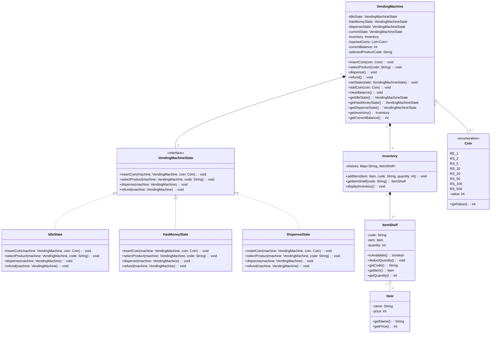

# 📐 State Design Pattern & Vending Machine System LLD

## 1. State Design Pattern: Quick Recap

### What is it?
The **State Design Pattern** is a behavioral design pattern that allows an object to alter its behavior when its internal state changes. It makes the object appear to change its class.

### Problem It Solves
Without the State Pattern, an object’s behavior depends on conditional statements (`if-else` or `switch-case`) checking its state. As states grow, code becomes unmaintainable and violates the **Open/Closed Principle**.

---

### High-Level Example: Smartphone Power Button

Consider a smartphone with a single physical **Power Button**. The behavior of pressing this button changes dynamically based on the phone's internal state:

```text
                  ┌────────────────────────┐
                  │      Smartphone        │
                  │  (Context - holds state)│
                  └───────────┬────────────┘
                              │
                        current_state
                              │
         ┌────────────────────┼────────────────────┐
         ▼                    ▼                    ▼
  [ OffState ]         [ LockedState ]      [ UnlockedState ]
  ────────────         ───────────────      ─────────────────
  pressPowerButton():  pressPowerButton():  pressPowerButton():
  • Boots up phone     • Turns screen ON    • Locks phone &
  • Transition to      • Shows lockscreen     turns screen OFF
    LockedState        • Stays in           • Transition to
                         LockedState          LockedState
```
Instead of the Smartphone class using a giant switch(state) block, it delegates the action to its current state object:

### 💻 Code with Syntax Highlighting
```java
// Context delegates to current state
public void pressPowerButton() {
    currentState.pressPowerButton(this);
}
```

### Core Components of the Pattern
Context (VendingMachine / Smartphone): The primary object users interact with. Maintains a reference to the currentState.
State Interface (VendingMachineState): Defines the contract for all supported actions across states.
Concrete States (IdleState, HasMoneyState, DispenseState): Implement state-specific behaviors and drive state transitions.

## 2. Vending Machine System Design (UML Architecture)
Graphical UML Diagram
